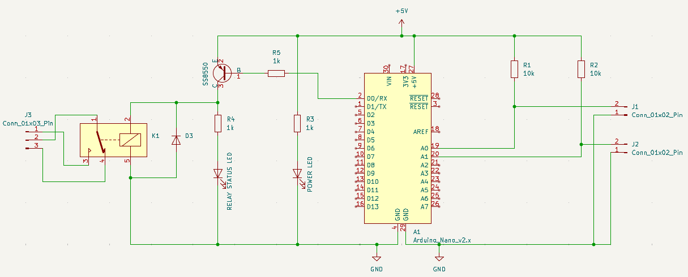

# Irrigation-automatique
This project is an automatic irrigation for green wall using arduino.
It uses two moisture sensors, one on top of the wall to know when to open the solenoid valve and one on bottom to close the solenoid valve when the dirt is wet enough.

## Electrical circuit
I used Kicad to make the following electrical circuit.

YL-69 are moisture sensors and the right part represent the 5V relay to activate solenoid valve.